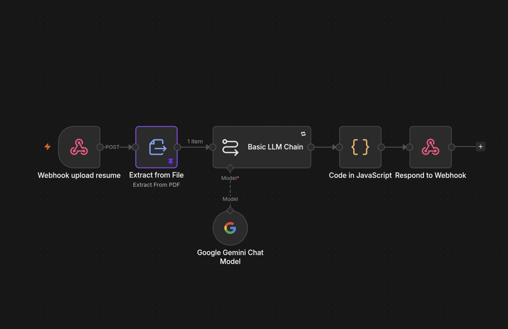
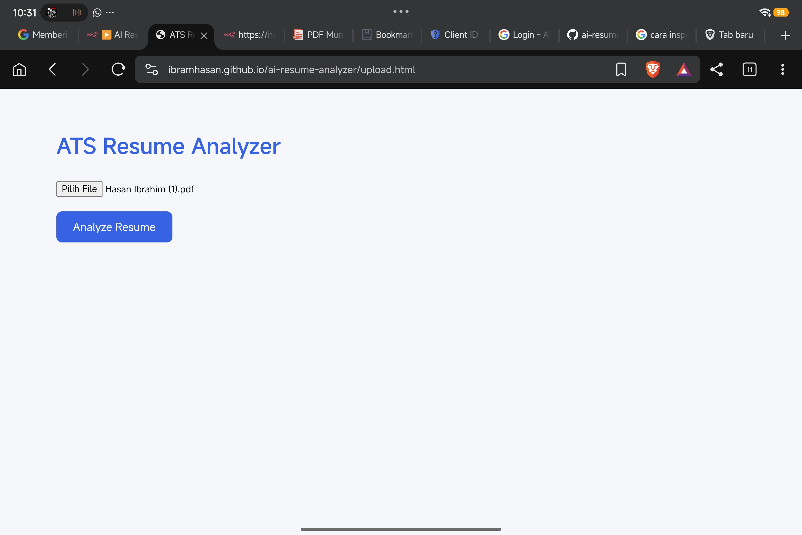
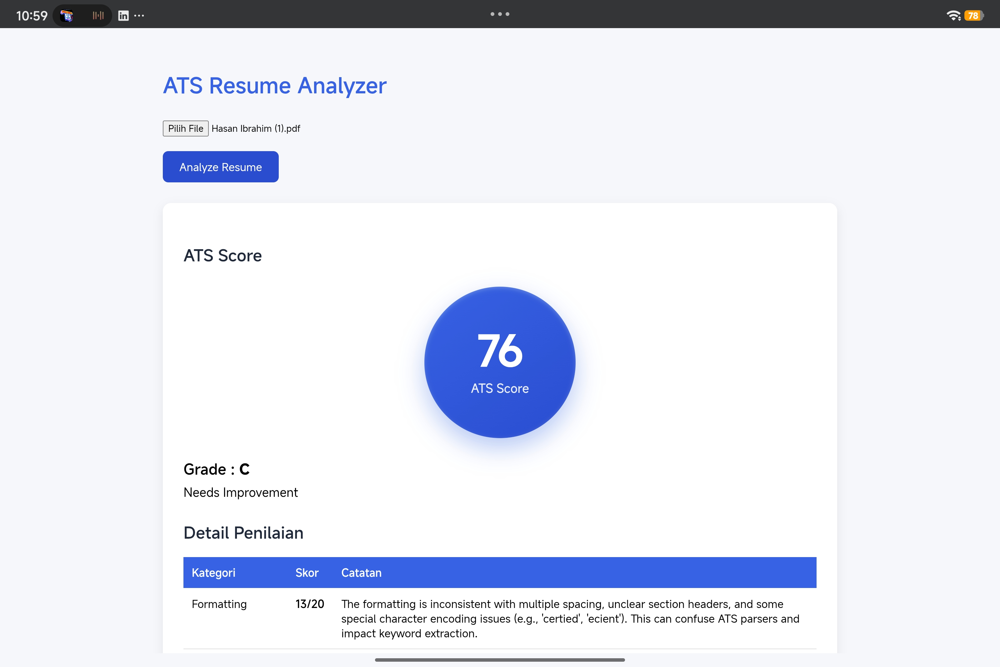
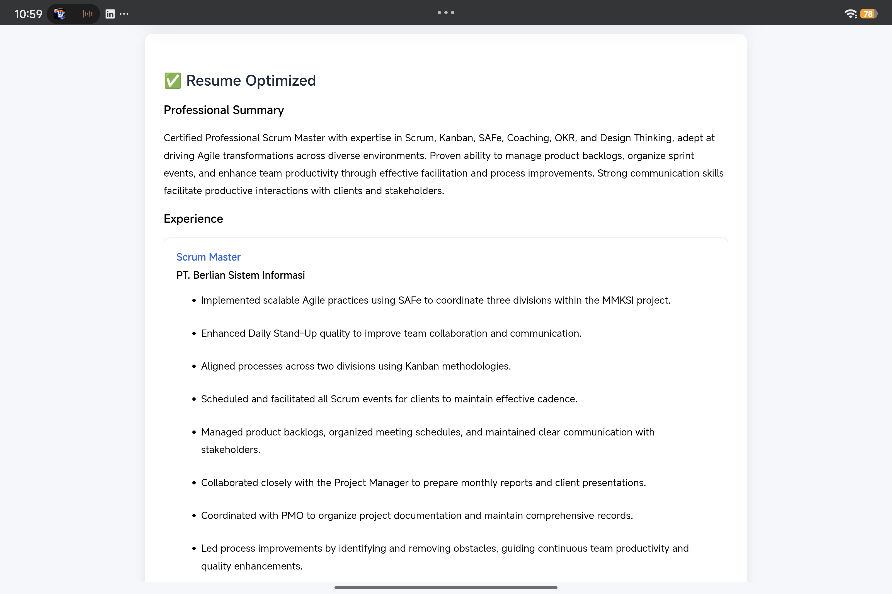
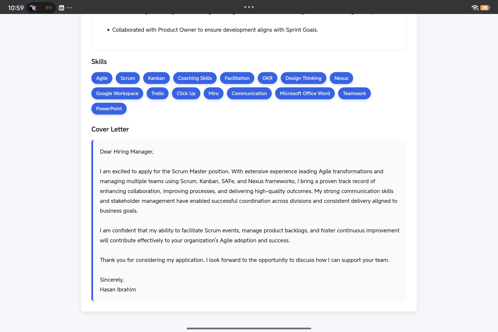
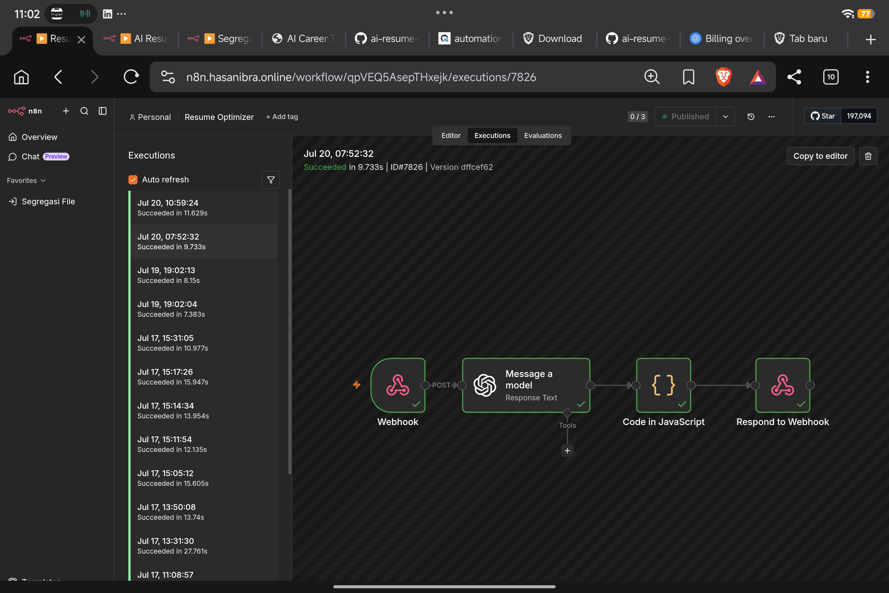

# AI Career Toolkit

## 📖 Overview

AI Career Toolkit is a web application designed to help job seekers improve their career documents using Artificial Intelligence.

The application currently provides AI-powered tools to analyze and optimize resumes, helping candidates create more ATS-friendly applications.

---

## ✨ Features

### 📄 Resume Analyzer

Upload your resume in PDF format and receive:

- ATS Compatibility Score
- Resume Strengths
- Areas for Improvement
- Actionable Recommendations

#### Resume Analyzer Workflow



#### Upload Resume



#### ATS Analysis Result



---

### 🚀 Resume Optimizer

Automatically improves your resume while preserving factual information.

Generated outputs include:

- Professional Summary
- Optimized Work Experience
- Optimized Skills
- AI-Generated Cover Letter

#### Optimized Resume



#### AI-generated Cover Letter



#### Resume Optimizer Workflow



---

## 🛠️ Tech Stack

### Frontend

- HTML5
- CSS3
- JavaScript

### Backend

- n8n
- OpenAI API
- PDF Text Extraction

### Deployment

- GitHub Pages

---

## ⚙️ System Architecture

```text
User
   │
   ▼
GitHub Pages
   │
   ▼
n8n Webhook
   │
   ▼
Extract PDF Text
   │
   ▼
OpenAI
   │
   ▼
JSON Response
   │
   ▼
Frontend
```

---

## 🎯 Roadmap

Planned future enhancements:

- AI Interview Preparation
- LinkedIn Profile Optimizer
- Career Roadmap Generator
- Portfolio Review
- Job Description Match Analysis

---

## 🌐 Live Demo

https://ibrahamhasan.github.io/ai-resume-analyzer/

---

## 📄 License

This project is intended for educational and portfolio purposes.
